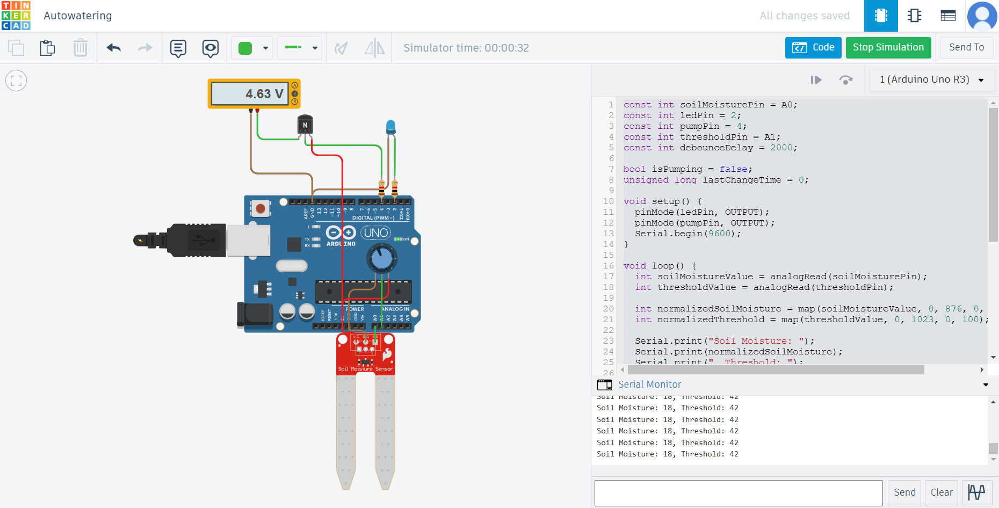
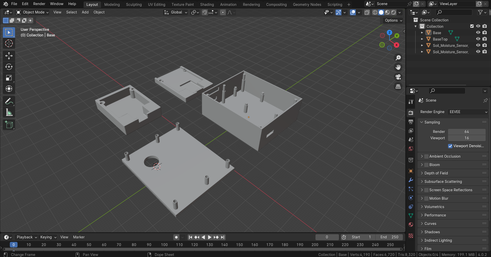

# Простая система автоматического полива растений
## Как работает:
Автоматически включает насос подающий воду в горшок растения при низком уровне влажности почвы.
## Схема в тинкеркад:

## Модели корпуса для 3Д печати:

## Список компонентов:
1) Arduino Nano V3.0
2) 10K Ohm Rotary Potentiometer
3) Погружной водяной мини-насос DC5V, 120L-H
4) Soil Moisture Sensor Module
5) LED-diode
6) NPN transistor
7) Resistor x 2 
